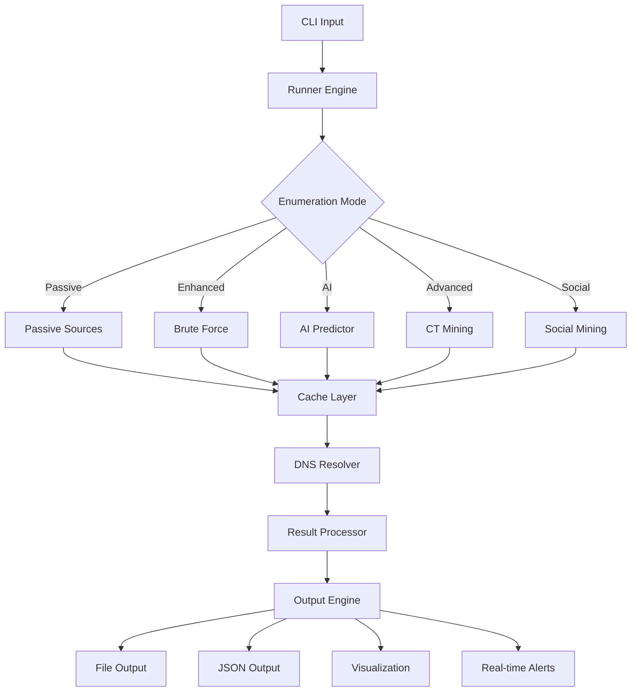

# 🏗️ Stormfinder Architecture

## 📁 **Project Structure**

```
stormfinder/
├── 📁 .github/                    # GitHub workflows and templates
│   ├── workflows/                 # CI/CD pipelines
│   ├── ISSUE_TEMPLATE/            # Issue templates
│   └── PULL_REQUEST_TEMPLATE.md   # PR template
├── 📁 cmd/                        # Application entry points
│   └── stormfinder/               # Main application
├── 📁 pkg/                        # Core library packages
│   ├── ai/                        # AI-powered prediction engine
│   ├── bruteforce/                # DNS brute force enumeration
│   ├── cache/                     # Intelligent caching system
│   ├── ctlogs/                    # Certificate transparency mining
│   ├── mapping/                   # Relationship mapping & visualization
│   ├── monitor/                   # Real-time monitoring system
│   ├── optimizer/                 # Performance optimization
│   ├── passive/                   # Passive enumeration sources
│   ├── permutation/               # Subdomain permutation generation
│   ├── resolve/                   # DNS resolution and validation
│   ├── runner/                    # Core execution engine
│   ├── social/                    # Social media & code repository mining
│   └── subscraping/               # Source-specific scrapers
├── 📁 docs/                       # Documentation
│   ├── ARCHITECTURE.md            # This file - system architecture
│   ├── API.md                     # API documentation
│   ├── CONTRIBUTING.md            # Contribution guidelines
│   └── examples/                  # Usage examples
├── 📁 scripts/                    # Build and utility scripts
│   ├── build.sh                   # Build automation
│   ├── test.sh                    # Testing automation
│   └── install.sh                 # Installation script
├── 📁 static/                     # Static assets
│   ├── stormfinder-logo.png       # Project logo
│   └── stormfinder-run.png        # Demo screenshot
├── 📁 configs/                    # Configuration templates
│   ├── config.yaml.example        # Main config template
│   └── providers.yaml.example     # Provider config template
├── 📁 wordlists/                  # Built-in wordlists
│   ├── common.txt                 # Common subdomains
│   ├── tech-stack.txt             # Technology-specific terms
│   └── industry.txt               # Industry-specific terms
├── 📄 README.md                   # Main project documentation
├── 📄 FEATURES.md                 # Comprehensive feature list
├── 📄 INSTALL.md                  # Installation guide
├── 📄 LICENSE.md                  # License information
├── 📄 CHANGELOG.md                # Version history
├── 📄 SECURITY.md                 # Security policy
├── 📄 go.mod                      # Go module definition
├── 📄 go.sum                      # Go module checksums
├── 📄 Makefile                    # Build automation
├── 📄 Dockerfile                  # Container configuration
└── 📄 .goreleaser.yml             # Release automation
```

## 🧩 **Core Components**

### **🎯 Entry Point (`cmd/`)**
- **stormfinder/main.go**: Application entry point and CLI setup

### **📦 Core Library (`pkg/`)**

#### **🤖 AI Engine (`pkg/ai/`)**
- **predictor.go**: Machine learning subdomain prediction
- **models.go**: AI model definitions and training
- **patterns.go**: Pattern recognition algorithms

#### **⚡ Enumeration Engines**
- **passive/**: 46+ passive intelligence sources
- **bruteforce/**: DNS brute force with smart wordlists
- **permutation/**: Intelligent subdomain mutations

#### **🔍 Advanced Mining**
- **ctlogs/**: Certificate transparency analysis
- **social/**: Social media and repository mining
- **mapping/**: Relationship analysis and visualization

#### **🚀 Performance & Infrastructure**
- **cache/**: Intelligent result caching
- **optimizer/**: Speed and memory optimization
- **resolve/**: DNS resolution and validation
- **runner/**: Core execution orchestration

#### **📡 Monitoring**
- **monitor/**: Real-time discovery and alerting

## 🔄 **Data Flow Architecture**



## 🏛️ **Design Principles**

### **1. Modularity**
- Each package has a single responsibility
- Clean interfaces between components
- Easy to extend and maintain

### **2. Performance**
- Concurrent processing throughout
- Intelligent caching strategies
- Memory-efficient algorithms

### **3. Extensibility**
- Plugin architecture for new sources
- Configurable AI models
- Custom output formats

### **4. Reliability**
- Comprehensive error handling
- Graceful degradation
- Extensive testing coverage

## 🔧 **Configuration Management**

### **Hierarchical Configuration**
1. **Default Values**: Built-in sensible defaults
2. **Config Files**: YAML configuration files
3. **Environment Variables**: Runtime overrides
4. **CLI Flags**: Command-line parameters

### **Configuration Locations**
- **System**: `/etc/stormfinder/`
- **User**: `~/.config/stormfinder/`
- **Project**: `./configs/`

## 🧪 **Testing Strategy**

### **Test Structure**
```
pkg/
├── ai/
│   ├── predictor.go
│   └── predictor_test.go
├── bruteforce/
│   ├── bruteforce.go
│   └── bruteforce_test.go
└── ...
```

### **Test Types**
- **Unit Tests**: Individual component testing
- **Integration Tests**: Component interaction testing
- **End-to-End Tests**: Full workflow testing
- **Performance Tests**: Benchmarking and profiling

## 📊 **Monitoring & Observability**

### **Logging Levels**
- **DEBUG**: Detailed debugging information
- **INFO**: General operational messages
- **WARN**: Warning conditions
- **ERROR**: Error conditions
- **FATAL**: Critical errors

### **Metrics Collection**
- **Performance Metrics**: Response times, throughput
- **Discovery Metrics**: Subdomains found, source effectiveness
- **System Metrics**: Memory usage, CPU utilization

## 🔐 **Security Considerations**

### **API Key Management**
- Secure storage in configuration files
- Environment variable support
- No hardcoded credentials

### **Network Security**
- Proxy support for corporate environments
- Rate limiting to avoid abuse
- Respectful source interaction

## 🚀 **Deployment Options**

### **Binary Distribution**
- Cross-platform compiled binaries
- No runtime dependencies
- Easy installation and updates

### **Container Deployment**
- Docker images for consistent environments
- Kubernetes manifests for scaling
- Cloud-native deployment options

### **Package Managers**
- Go modules for developers
- Homebrew for macOS users
- APT/YUM packages for Linux

## 📈 **Scalability Design**

### **Horizontal Scaling**
- Stateless design for easy scaling
- Distributed caching support
- Load balancing capabilities

### **Vertical Scaling**
- Memory-efficient algorithms
- CPU optimization
- Configurable resource limits

This architecture ensures Stormfinder is maintainable, scalable, and professional-grade! 🌪️
